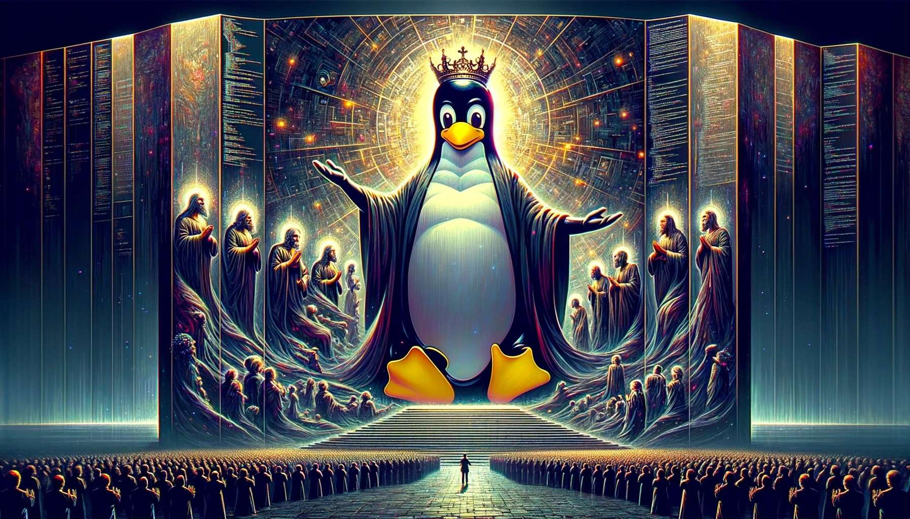

# 🏰 İmparator Tux'un Krallığı 🏰

Hoş geldiniz, gezginler 🚶‍♂️, bilge kâşifler 🧙‍♂️ ve kod savaşçıları 🗡️. Sizleri, efsanevi İmparator Tux'un 👑 hüküm sürdüğü, açık kaynak gücünün 💻 her köşeyi aydınlattığı, Linux'un hakim olduğu fantastik bir orta dünya olan Tuxlandia'ya davet ediyorum.

## 🌲 Tuxlandia Hakkında 🌲

Burası, sınırsız imkanların ve muazzam fırsatların diyarıdır 🌟. Dağların 🏔️ arasında gizlenmiş eski yazılımlar, derin ormanlarda saklı komut satırları 🌳 ve büyülü scriptlerle dolu gizemli mağaralar... İmparator Tux, bilgeliği ve açık kaynak felsefesiyle bu toprakları yönetir 📚. Tuxlandia'da, her kod parçası bir maceradır ve her commit, destansı bir hikayenin parçasıdır 📖.

### 🦸‍♂️ İmparator Tux'un Kahramanları 🦸‍♀️

- **Sir Linus the Bold** 🛡️: Kernel Kalesi'nin muhafızı, cesur ve bilge bir lider.
- **Lady GNU** 🌿: Özgür Yazılım Ormanı'nın koruyucusu, özgürlük ve eşitlik sembolü.
- **The Bash Brothers** 🧙‍♂️: Kabuk büyücüleri, her komutlarıyla gerçekleri açığa çıkarırlar.
- **Python Priestess** 🐍: Yüksek seviyeli büyülerin ustası, temiz ve okunabilir büyüler yaratır.

### 🤝 Nasıl Katkıda Bulunabilirsiniz

1. **Yol Arkadaşı Olun** 🌟: Projemize yıldız vererek ve takip ederek destek olabilirsiniz.
2. **Kahraman Olun** 🦸: Hataları düzeltin, yeni özellikler ekleyin ve büyümeye yardımcı olun.
3. **Bilge Olun** 📚: Dokümantasyonumuzu geliştirerek bilginin serbest akışını sağlayın.

## 📜 Efsanenin Parçası Olun 📜

Tuxlandia'nın kapıları her zaman açıktır 🚪. İster yeni bir gezgin, ister deneyimli bir savaşçı olun, bu diyar sizin için de yer var 🌍. Projemize katılın ve açık kaynak dünyasının efsanevi kahramanları arasında yerinizi alın 🌟.

İletişim için: 📧 [harunerdogan1305@gmail.com](mailto:harunerdogan1305@gmail.com)

"Tuxlandia'da, her satır kod bir büyüdür ✨ ve her pull request bir destandır 🚩."

Hoş geldiniz, ve unutmayın: İmparator Tux'un gölgesinde, kod her zaman özgürdür 💫.

<!--
**hrn-erdgn/hrn-erdgn** is a ✨ _special_ ✨ repository because its `README.md` (this file) appears on your GitHub profile.

Here are some ideas to get you started:

- 🔭 I’m currently working on ...
- 🌱 I’m currently learning ...
- 👯 I’m looking to collaborate on ...
- 🤔 I’m looking for help with ...
- 💬 Ask me about ...
- 📫 How to reach me: ...
- 😄 Pronouns: ...
- ⚡ Fun fact: ...
-->
